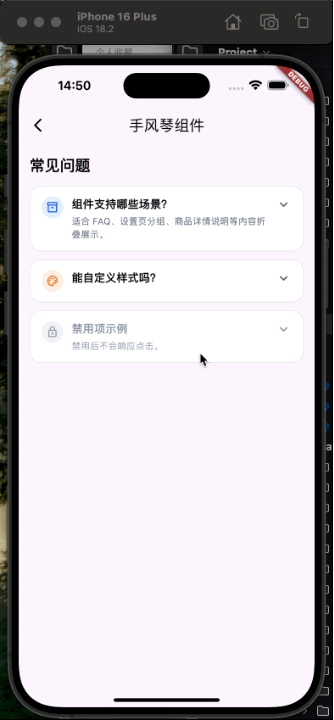

# accordion_demo

一个基于 Flutter 的手风琴组件示例项目，核心实现为 `HsAccordion`。项目演示了 FAQ、设置分组、说明信息折叠等常见场景下的单开式折叠面板写法，并提供了较完整的样式扩展能力。

## 文章地址[]

## 展示图


## 项目定位

这个仓库更接近“组件 Demo”而不是完整业务应用：

- `lib/src/widgets/hs_accordion.dart` 提供可复用的手风琴组件实现
- `lib/src/pages/accordion_page.dart` 提供示例页面，展示组件的典型使用方式
- `lib/main.dart` 负责启动 Demo 应用

如果你只想复用组件本身，重点关注 `HsAccordion` 和 `HsAccordionItem` 即可。

## 功能概览

当前组件具备以下能力：

- 单开模式，同一时间仅展开一个面板
- 支持默认展开项 `initialExpandedIndex`
- 支持展开状态变更回调 `onChanged`
- 支持禁用单项 `enabled`
- 支持标题、副标题、前置图标、后置组件
- 支持统一样式配置和单项样式覆盖
- 支持自定义边框、圆角、背景色、内边距
- 内置展开/收起动画和箭头旋转动画

示例页面中已经覆盖了 3 类场景：

- 默认展开项
- 样式定制项
- 禁用项

## 目录结构

```text
lib/
├── main.dart
└── src/
    ├── pages/
    │   └── accordion_page.dart
    └── widgets/
        └── hs_accordion.dart
test/
└── widget_test.dart
```

核心文件说明：

- `lib/main.dart`：应用入口，启动 `AccordionPage`
- `lib/src/pages/accordion_page.dart`：手风琴组件展示页
- `lib/src/widgets/hs_accordion.dart`：组件和数据结构定义
- `test/widget_test.dart`：当前仍是 Flutter 模板测试，尚未与项目实际页面同步

## 组件用法

### 基础示例

```dart
HsAccordion(
  initialExpandedIndex: 0,
  items: [
    HsAccordionItem(
      title: const Text('组件支持哪些场景？'),
      subtitle: const Text('FAQ、设置页分组、说明信息折叠'),
      content: const Text('HsAccordion 默认是单开模式。'),
    ),
    HsAccordionItem(
      title: const Text('能自定义样式吗？'),
      content: const Text('支持边框、圆角、背景色、内边距等样式配置。'),
    ),
  ],
)
```

### 带回调的示例

```dart
HsAccordion(
  initialExpandedIndex: 0,
  onChanged: (int? index) {
    debugPrint('当前展开项: $index');
  },
  items: [
    HsAccordionItem(
      title: const Text('标题 1'),
      content: const Text('内容 1'),
    ),
    HsAccordionItem(
      title: const Text('标题 2'),
      content: const Text('内容 2'),
    ),
  ],
)
```

### 单项样式覆盖示例

```dart
HsAccordion(
  items: [
    HsAccordionItem(
      title: const Text('自定义样式项'),
      content: const Text('这项使用了单独的背景色和圆角。'),
      backgroundColor: const Color(0xFFFFFFFF),
      expandedBackgroundColor: const Color(0xFFF8FAFC),
      borderRadius: BorderRadius.circular(20),
      headerPadding: const EdgeInsets.symmetric(
        horizontal: 20,
        vertical: 16,
      ),
      contentPadding: const EdgeInsets.fromLTRB(20, 0, 20, 20),
    ),
  ],
)
```

## API 说明

### `HsAccordion`

| 参数 | 类型 | 说明 |
| --- | --- | --- |
| `items` | `List<HsAccordionItem>` | 面板数据列表，必传 |
| `initialExpandedIndex` | `int?` | 默认展开项下标 |
| `onChanged` | `ValueChanged<int?>?` | 展开项变化回调，全部收起时返回 `null` |
| `itemSpacing` | `double` | 面板之间的垂直间距 |
| `headerPadding` | `EdgeInsetsGeometry` | 默认标题区域内边距 |
| `contentPadding` | `EdgeInsetsGeometry` | 默认内容区域内边距 |
| `backgroundColor` | `Color` | 默认收起背景色 |
| `expandedBackgroundColor` | `Color` | 默认展开背景色 |
| `border` | `BoxBorder?` | 默认边框 |
| `borderRadius` | `BorderRadius` | 默认圆角 |
| `iconColor` | `Color` | 默认箭头颜色 |
| `disabledColor` | `Color` | 禁用态颜色 |
| `animationDuration` | `Duration` | 动画时长 |
| `animationCurve` | `Curve` | 动画曲线 |
| `clipBehavior` | `Clip` | 裁剪行为 |

默认行为：

- 组件是单开模式，不支持多项同时展开
- 点击当前已展开项时，会收起该项
- `initialExpandedIndex` 会在 widget 更新时重新同步到内部状态

### `HsAccordionItem`

| 参数 | 类型 | 说明 |
| --- | --- | --- |
| `title` | `Widget` | 标题，必传 |
| `content` | `Widget` | 展开内容，必传 |
| `subtitle` | `Widget?` | 副标题 |
| `leading` | `Widget?` | 标题左侧组件 |
| `trailing` | `Widget?` | 标题右侧组件，不传时使用默认箭头 |
| `enabled` | `bool` | 是否允许点击展开，默认 `true` |
| `backgroundColor` | `Color?` | 单项收起背景色 |
| `expandedBackgroundColor` | `Color?` | 单项展开背景色 |
| `border` | `BoxBorder?` | 单项边框 |
| `borderRadius` | `BorderRadius?` | 单项圆角 |
| `headerPadding` | `EdgeInsetsGeometry?` | 单项标题区域内边距 |
| `contentPadding` | `EdgeInsetsGeometry?` | 单项内容区域内边距 |

## 代码实现要点

`HsAccordion` 本身是一个 `StatefulWidget`，通过 `_expandedIndex` 维护当前展开项。主要实现方式如下：

- 通过 `_toggleItem` 在点击时切换当前展开状态
- 使用 `AnimatedContainer` 实现面板背景和容器样式过渡
- 使用 `AnimatedRotation` 实现箭头旋转
- 使用 `AnimatedSize` 实现内容区展开和收起动画
- 使用 `ClipRect` 避免收起动画阶段内容溢出

这意味着它适合中小规模列表场景；如果未来需要处理超长列表或复杂嵌套，可以考虑进一步封装为支持懒加载的列表版本。

## 后续建议

如果要把这个仓库继续完善成一个可演示、可复用的组件示例项目，建议下一步补充：

1. 将 `test/widget_test.dart` 改为针对 `HsAccordion` 的真实组件测试
2. 增加展开、收起、禁用态、回调触发等关键交互断言
3. 如果计划跨项目复用，可进一步抽成独立 package

## License

当前仓库未声明许可证。如需开源或对外分发，建议补充明确的 License 文件。
